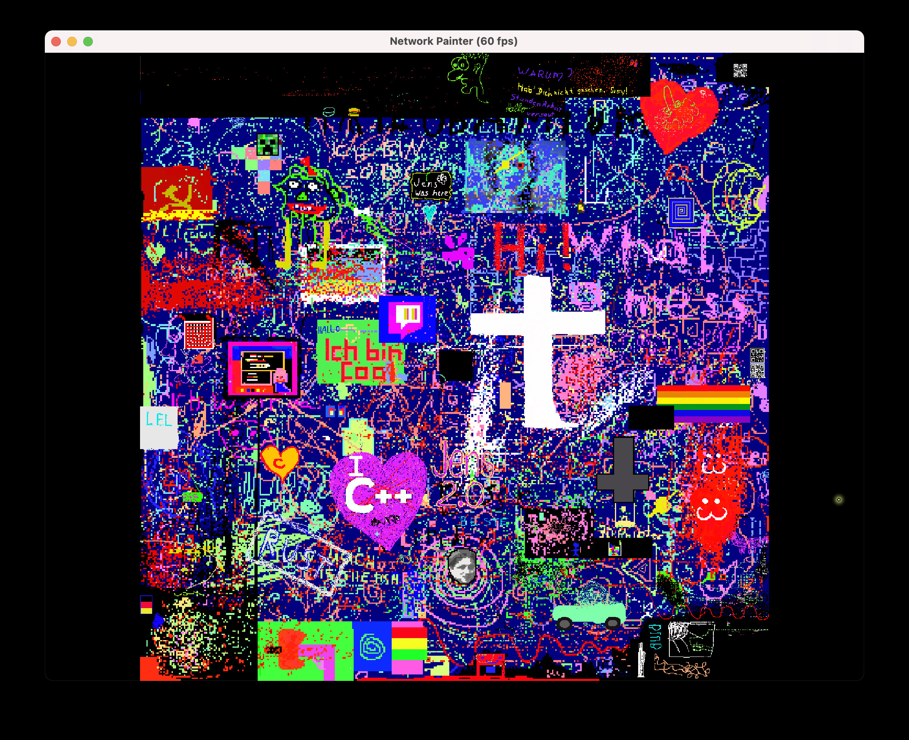

## NetPaint

A simple network painting app.

## Getting the Client Software

Compile from source or download the installer for Microsoft Windows.

[Windows Installer](https://github.com/JensDerKrueger/lnc/raw/master/cpp/OpenGL/24_Netpaint/VS/Output/setup.exe)

## Client Usage

Simply start the client. It will ask you for a server address (feel free to use our paint server, details below) and your username. Once the connection has been established you can paint with our mouse by left-clicking anywhere on the canvas. Turning the mouse-wheel will zoom, right-clicking and dragging will pan the canvas. To leave the application simply close the window or hit ESC. If you want to change the color, hit the 'c' - key to open the color chooser. In this mode simply left click on the desired color and continue painting. In the color chooser mode you can use the mouse wheel to change the color's brightness. You can also store up to 10 colors for quick access by simply hitting the 1 to 0 keys on the keyboard when in color chooser mode. The color under the cursor will be assigned to that key. In paint mode you can switch to that color by hitting the number key again. Using the 'l' key you can turn the name labels of the other users on or off. The 'r' - key resets view and re-centers the canvas, with 'q' and 'w' you can change the scale of the mouse-wheel to zoom faster or more precise. If you want a copy of the artwork, simply hit 'p'. In Summary:

Keys in *Paint Mode*:
* 'c' switch to Color Chooser Mode
* '1' ... '0' restore color
* 'l' toggle other painter's labels
* 'r' reset view
* 'q' and 'w' change mouse wheel sensitivity 
* 'p' save screenshot
* 'ESC' close application

Keys in *Color Chooser Mode*:
* 'c' or ESC switch to Paint Mode
* '1' ... '0' store color

## Demo Server

If you don't want to run your own server, feel free to paint to our public demo server (no offensive content, please). The server is available at lnc.myfirewall.org 
