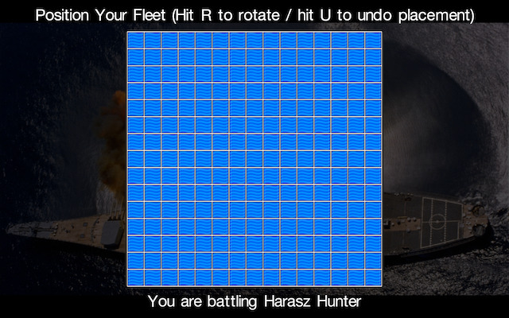
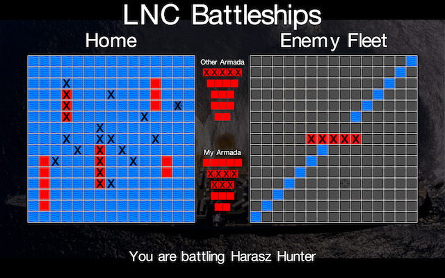

## Battleships

  

A simple multiplayer sink my battleships app.

## Getting the Client-Software

Compile from source or download the installer for Microsoft Windows.

[Windows Installer](https://github.com/JensDerKrueger/lnc/raw/master/cpp/OpenGL/26_BattleShips/VS/Output/setup.exe)

## Client Usage

Simply start the client. It will ask you for a server address, feel free to use our game-server (details below), and your username. Once the connection has been established, the game will wait for another player to join. Once it has found another player, it will connect you and ask you to place your armada. You have to place six ships total, one 2-square ship, two 3-square ships, two 4-square ships, and one 5-square ship. You can use the `r`- key (or right mouse button) to rotate the ship and the `u`-key to undo a placement.
Once you have placed all of your ships the game will wait for your opponent. Once the opponent has also completed the armada-setup the game will begin.

You can create a text-document named `settings.txt` in the same directory as the binary to store the server address and your callsign to avoid having to type them every time the game starts. The first line in the text-document should contain the address and the second line your callsign. You can also leave either of the two lines blank and the game will ask you for those parameters at startup.

## Getting the Server-Software

You can download the source-code of the demo server [here](https://github.com/JensDerKrueger/lnc/tree/master/cpp/OpenGL/25_GenericGameServer).

## Server Usage

Simply start the executable. The server features a minimalistic console to set a few parameters and output a few metrics. Hit `?` followed return to see a complete list of available commands. Hitting `q` will terminate all active connections and shut the game server down.

## Bot Usage

Just in case you don't see hundreds of users connect to you game server in a matter of seconds after you announce its existence, you may want to run a bot to battle that one lonely player (which will be most likely you). To do so you can compile the Battleship-Bot from [here](https://github.com/JensDerKrueger/lnc/tree/master/cpp/OpenGL/27_BattleshipBot), put your server URL in the `settings.txt`-file and simply start it.

## Demo Server

If you don't want to run your own server, feel free to use our public demo server. The server is available at `lnc.myfirewall.org`.
