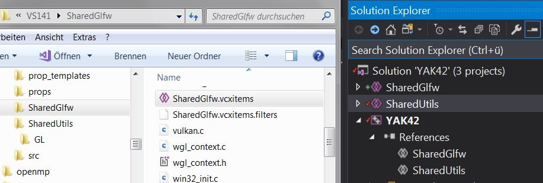
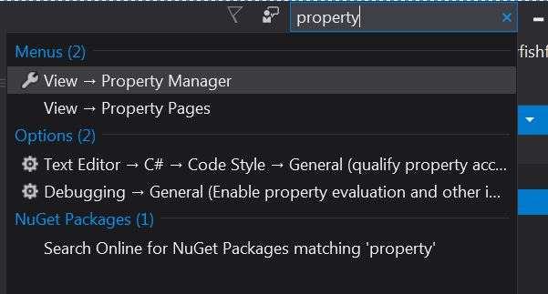
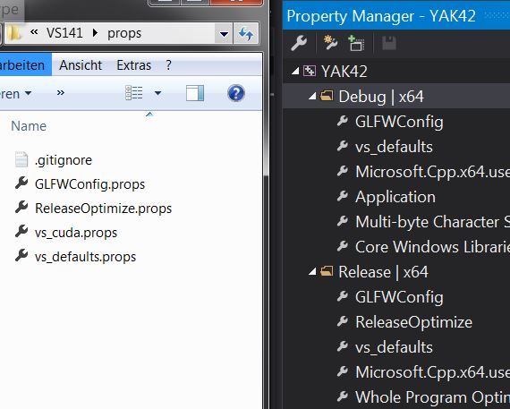
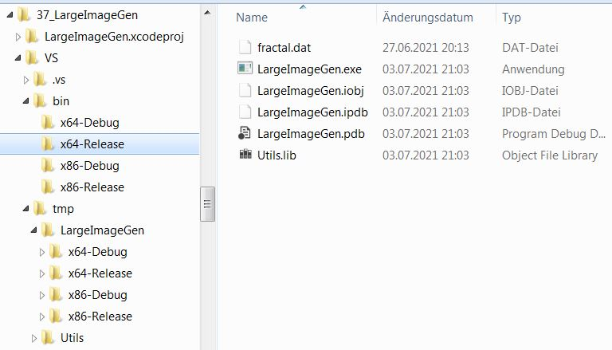

herein are some templates meant to be copied to the VS141/props-folder\
the props-folder itself is mentioned in .gitignore so its contents\
can be customized to the local environment without being affected by git merges or something.\
\
on a new project add the shared projects for glfw and utils.\
mention those as reference in the project of the executable.

\
to set include and libraryfolders add the props-files in the visualstudio-propertymanager

\
vs_defaults.props :\
sets the bin and tmp-folder per solution.\
sets the location of the vs-lib and vs-include folder, also adds the opengl32.lib in the linker-settings.\
every binary will be placed into the bin-folder,\
this also includes static libs. so the bin-folder got included as librarypath as well.\
Another defaultsetting is the c++ version you intend to use, and the conformance-mode.\
this depends on the visualstudio-version (or msbuild-environment) installed on your system.\
result of a build will have tmp and bin. to clean up, tmp can be deleted safely.\

\
GLFWConfig.props :\
will set c++ preprocessor-defines _GLFW_WIN32;_GLFW_USE_HYBRID_HPG;\
necessary for synergy with the SharedGlfw-Reference
\
vs_cuda.props :\
contains opencl include and lib-directory.\
allows the "#include <cl/opencl.h>"\
current default assumes the nvidia cuda sdk which sets %CUDA_PATH%-environmentvariable.\
Alternative would be lib and include-folder of the khronos opencl-sdk found on github. would be another propsfile\
(you'll have to run cmake and build the libs yourself when using khronos)